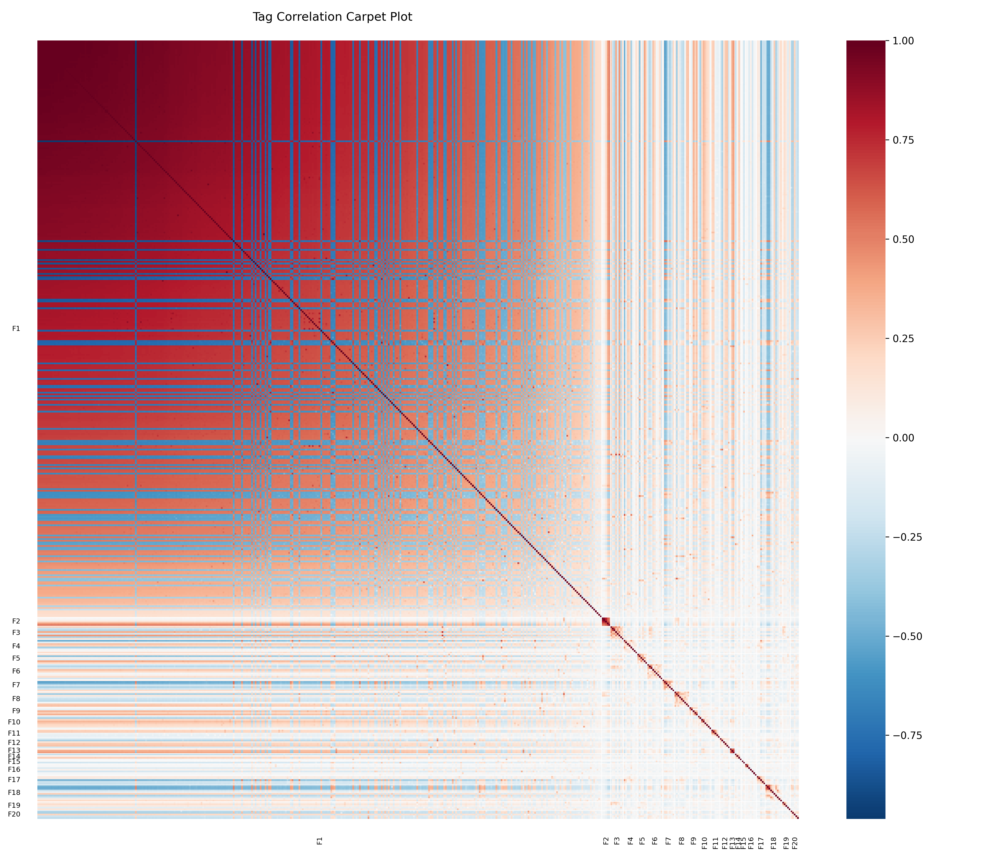

# Methodology

## 1. Data Collection & Preprocessing
The initial dataset consists of Steam games as of March 2025 downloaded from [Kaggle](https://www.kaggle.com/datasets/artermiloff/steam-games-dataset). Each month Steam is scraped for new content/scores/reviews/descriptions/comments etc. Data is collected directly from the [**Steam Storefront**](https://store.steampowered.com/) and the official [**Steam API**](https://developer.valvesoftware.com/wiki/Steam_Web_API) to ensure high fidelity for user tags and review counts. Review counts are prioritized from **English** language sources where available, falling back to global counts to ensure relevance for English-speaking users while maintaining coverage for international titles.

## 2. Semantic Embeddings
To enable natural language search, we use the [all-MiniLM-L6-v2](https://huggingface.co/sentence-transformers/all-MiniLM-L6-v2) SentenceTransformer model. To improve precision, we utilize a **Dual Semantic Vector** system.
- **Structural Vector:** Encodes the categorical properties of a game, such as its **Genres** and **Tags**. This captures the "what it is" aspect of the game.
- **Descriptive Vector:** Encodes the narrative and "vibe" of a game using its **Short Description** and **User Reviews**. This captures the "how it feels" and "how it's talked about" aspects of the game.
- **Process:** Each piece of text is converted into a high-dimensional vector that represents its meaning. If the text is a single word, the model encodes the expected context of that word. Groups of words have their vectors pooled, allowing long text to be represented by a single vector.  
- **Usage:** The similarity between these vectors is measured using [cosine similarity](https://en.wikipedia.org/wiki/Cosine_similarity), which gives a numerical value indicating how alike their meanings are. This allows the model to recognize synonyms like "peaceful" and "calm" as closely related concepts, even if the words don't match exactly. By calculating the angle between vectors, we can compare the user prompt with both the description and tags of games in the database. When using "Seed" games, the system performs specialized matching: structural seed vectors are compared against other games' structural vectors, and descriptive against descriptive. This prevents "meaning leak"—for example, it ensures that a seed game's narrative description doesn't incorrectly match an unrelated game just because they share a common tag word.

- **Whitening:** To improve semantic precision, we apply [Zero-phase Component Analysis (ZCA) Whitening](https://martin-thoma.com/zca-whitening/) to the semantic vectors. Raw transformer embeddings on specialized sets of text (e.g., video game descriptions) often have high correlation between dimensions and a significant non-zero mean, which can bias searches toward common semantic themes. We first subtract the global mean of the embeddings to center the distribution, then apply ZCA on the mean-centered data to decorrelate dimensions. This ensures that the similarity metric focuses on unique game characteristics and improves the specificity of natural language queries. The stored mean and transformation matrix are both applied to user prompts at query time to maintain alignment in the decorrelated space. 

## 3. Tag Embeddings
Steam tags are user-contributed and often noisy. We apply a pipeline to transform these raw counts into robust "tag vectors" that capture the stylistic profile of each game.

- **Iterative EM Imputation:** To handle unobserved tags (Steam limits API responses to the top 20 tags), we use an Iterative Expectation-Maximization (EM) algorithm. The E-step imputes counts for unobserved tags using the current covariance matrix (conditional expectation), capped by the count of the 20th tag. The M-step recalculates the global mean and covariance from these augmented profiles. This is repeated until the model converges to a stable estimate of the missing data. The result is a best guess for the distribution of censored tags that fall outside of the top 20. 
- **Stochastic Path Optimization:** To determine the optimal regularization constant $K$, we employ a simulation study. We select "reliable" games (with >1,000 votes) and simulate smaller versions of them by drawing samples from the data associated with one game at a time; the number of samples per game is a random variable taken from the sizes from the actual dataset distribution. We then solve for the $K$ that minimizes the Sum of Squared Errors (SSE) between the regularized synthetic profiles and the true reliable profiles.
- **Bayesian Regularization:** We apply Bayesian smoothing using the optimized $K$ to shrink low-information games toward the global prior.
- **Swappable Transformations & Bayesian Regularization:** We support three transformation options to stabilize the variance of tag counts: the [Anscombe Transform](https://en.wikipedia.org/wiki/Anscombe_transform) ($2\sqrt{x + 3/8}$), [Centered Log-Ratio (CLR)](https://en.wikipedia.org/wiki/Compositional_data#Center_log_ratio_transform), or an Identity transform. Currently we are evaluating whether any of these outperforms the others for quality of matches.
- **Process:** We first apply Bayesian regularization directly to the raw tag counts: $\text{Profile} = (C + K \cdot G) / (N + K)$, where $C$ is the count vector, $G$ is the global prior, and $N$ is the total votes. This ensures that the regularization happens on the "natural" scale of the data. We then apply the chosen transformation to both the regularized profile and the global prior. The final embedding is the difference between these two in the transformed space: $V = \text{Transform}(\text{Profile}) - \text{Transform}(G)$. This ensures that the "regularizing point" (a game with zero observed tags) resides at the origin ($0$) of the embedding space, making it a neutral reference for similarity calculations.

- **Regularized Similarity:** We use a **Regularized Cosine Similarity** for tag vectors: $\text{Sim}(A,B) = \frac{A \cdot B}{\|A\|\|B\| + \lambda}$. This effectively penalizes similarity scores for games with low-information (short) tag vectors, ensuring that recommendations are based on strong, confident tag matches. The parameter $\lambda$ is determined by fitting a [Chi-distribution](https://en.wikipedia.org/wiki/Chi-distribution) to the lengths (norms) of "low-tag" vectors (norms between 0 and 5). We set $\lambda$ to the 95th percentile of this fitted distribution, which represents the "noise floor" of the embedding space. This ensures that a vector's length must be statistically significant before it can achieve high similarity scores.

- **Whitening & Dimensionality Reduction:** To ensure stability and remove numerical noise, tag vectors undergo **Truncated PCA-ZCA Whitening**. The data is projected onto its top 128 principal components, which capture the vast majority of variance while eliminating singular dimensions (such as the linear constraint imposed by the CLR transform). This process decorrelates the tags and prevents "ghost" similarities between unrelated games.

## 4. Quality Scoring
Instead of raw review percentages, we use a Bayesian score that smooths out noisy reviews. This allows the system to distinguish between a game with 10 positive reviews out of 10 and a masterpiece with 98,000 positive reviews out of 100,000. 

The model we use is based around the idea that there is a latent quality score $Q$ for each game, a normally distributed range of possible experiences that users might have with that game, and a threshold where, if a user has an experience greater than the threshold, they will give a positive review. Under some minimal assumptions, this gives the relation $\frac{p}{p + n} = \Phi(Q)$, where $p$ and $n$ are the number of positive and negative reviews left for the game, respectively, and $\Phi$ is the [cumulative distribution function of a standard normal variable](https://en.wikipedia.org/wiki/Normal_distribution). However, we do not necessarily trust the overall review score, especially when there are only a few reviews; this is due to [the cold start problem](https://en.wikipedia.org/wiki/Cold_start_(recommender_systems)). So, we introduce a variable $s$ that "shrinks" the percentage of positive reviews toward a group mean, where $s$ has a larger effect for games with fewer reviews. The variable $s$ can be thought of as a set of initial reviews shared by all games that reduces the variability of estimates of $Q$ when there are few reviews. The resulting regularization scheme yields the following formula: $\frac{p + s \cdot a}{p + n + s} = \Phi(Q)$; solving for $Q$ gives $Q = \Phi^{-1}\left(\frac{p + s \cdot a}{p + n + s}\right)$.  

- **Components:** $p$ and $n$ are positive and negative reviews, $a$ is the global positive review rate derived from the dataset, and $s$ is a regularization constant.
- **Tunable Discovery:** The "Discovery" slider allows users to adjust $s$ in real-time. A high discovery setting ("Wild Cards") uses a low $s$, allowing "hidden gems" with few reviews to climb the rankings, while a low discovery setting ("Known Quantities") uses a high $s$ to ensure only established, highly-reviewed titles reach the top. The application uses a high-resolution precalculated grid (201 steps) to provide smooth transitions between these settings.
- **Probit Function:** $\Phi^{-1}$ is the [probit function](https://en.wikipedia.org/wiki/Probit), which converts probabilities into a linear scale (z-scores), making the differences between "great" and "perfect", or "bad" and "horrendous", more meaningful.
- **Score Normalization:** To maintain a consistent spread of scores in recommended games across different Discovery settings, we apply a linear transformation to the generated z-scores. This ensures that the mean scores of the top 500 and bottom 500 games remain aligned with a baseline distribution (s = 2000), preventing the score distribution from collapsing or expanding excessively at extreme parameter values.
- **Computational Efficiency:** To minimize memory usage on resource-constrained environments, the recommendation engine utilizes [Reduced Precision Arithmetic](https://en.wikipedia.org/wiki/Half-precision_floating-point_format) (FP16) for large-scale vector operations and [Memory-Mapped I/O](https://en.wikipedia.org/wiki/Memory-mapped_file) for static data artifacts. This allows the system to perform high-dimensional similarity searches while maintaining a memory footprint under 512 MB.

## 5. Playtime Regularization
To effectively rank games by length, we analyze the distribution of playtimes that are available as part of user reviews. We assume that negative reviews will bias the estimate of game length downward due to quitting the game before finishing it, so we discard those values. Median playtime estimates can be highly variable for games with few reviews, and to address this, we apply a Bayesian shrinkage method similar to our tag vector approach.

- **Stochastic Path Analysis:** We determine an optimal regularization constant $C$ by creating synthetic "small" games using reviews from "reliable" games (those with $\ge 80$ positive reviews). We solve for the $C$ that minimizes the error between the regularized estimate of the small game and the true median of the original reliable game.
- **Metric:** We regularize the logarithm of the median playtime: $\log(1 + \text{median})$.
- **Formula:** $\text{Regularized Log-Median} = \frac{n \cdot \text{Sample Log-Median} + C \cdot \text{Global Mean Log-Median}}{n + C}$, where $n$ is the number of positive reviews. This ensures that games with very few reviews are strongly pulled toward the global average, while games with substantial feedback retain their specific playtime identity.
- **Display:** The exponential of this regularized value is displayed as the estimation of length. 

## 6. Difficulty Prediction
Steam games do not natively have a "Difficulty" rating. To solve this, we built a predictive model using external data fitted to Steam game tags. 
- **Source Data:** We use an external dataset of ~3,200 games with explicit difficulty ratings that are in the Steam ecosystem.
- **Model:** We train a linear regression model to predict this difficulty score using Steam tags as features.
    - **Transformation:** Tag proportions and difficulty scores are transformed using [**Rank-Based Inverse Normal Transformation (Rank-INT)**](https://github.com/alexjamesing/RankBasedInverseNormal) to handle the sparse and non-normal distribution of tag data.
    - **Feature Selection:** We used [**Forward/Backward Iterative Feature Selection**](https://www.geeksforgeeks.org/machine-learning/feature-selection-techniques-in-machine-learning/) with [**Bayesian Information Criterion (BIC)**](https://en.wikipedia.org/wiki/Bayesian_information_criterion) to identify significantly predictive tags in the external data. Some of the significant predictors are obvious tags like ["Difficult"](https://store.steampowered.com/tags/en/Difficult), ["Precision Platformer"](https://store.steampowered.com/tags/en/Precision%20Platformer), and ["Souls-like"](https://store.steampowered.com/tags/en/Souls-like). There are also less obvious ones like ["Visual Novel"](https://store.steampowered.com/category/visual_novel) and ["Short"](https://store.steampowered.com/tags/en/Short), which predict easy games.  
- **Estimation** We apply this model to all steam games. The result is a difficulty prediction value from 0 to 10, where 0 indicates a very easy game and 10 indicates a very difficult one. The mean difficulty estimate for all Steam games is around 5.5, and our prediction for the most difficult game on Steam is [Tametsi](https://store.steampowered.com/app/709920/Tametsi/). Play it if you hate yourself.
- **Z-Scoring:** For the final difficulty rating, the predicted difficulty estimate is converted to a z-score relative to the distribution of all games that have tags. This allows users to weight games by their estimated challenge level on the same scale as other features, such as popularity or length.
- **Display:** The predicted 0-10 difficulty score is displayed directly on the game cards, providing a quick estimate of the expected challenge.

## 7. The Jackalope

The final recommendation list is generated as a hybrid, blending normalized components:
1.  **Semantic Match:** Similarity between the natural language prompt and game text.
2.  **Tag Match:** Similarity between the latent tag vectors. When z-scoring this component, we ignore games with 0 similarity to avoid biasing the distribution by the large number of games with no tag overlap.
3.  **Quality Score:** Preference for loved vs. hated games, smoothed by the Discovery setting.
4.  **Popularity:** Preference for high vs. low player counts.
5.  **Game Age:** Preference for new vs. classic titles.
5.  **Length:** Preference for short vs. long experiences.
6.  **Difficulty Rating:** Preference for Easy vs. Difficult games.

Users can tune these weights in the UI to prioritize long, easy, niche hidden gems or popular classics that are similar to a game of choice. 

**Data Reliability & Quality Adjustments:**
- **Review Count Repair:** To handle stale metadata, the system automatically repairs global review counts using raw individual reviews if our scrape finds more data than the storefront summary.
- **Age Stability:** Future release dates are clamped to the current date, and unknown dates are assigned a neutral z-score (0) to maintain distribution stability.
- **Global Clamping:** To prevent extreme outliers from disproportionately influencing the final score, all component z-scores are clamped between -8.0 and 8.0.

## 8. Filtering
The system allows real-time filtering for **Genres**, VR-Only titles, English language support, NSFW content (Adult Only banner), Software/Utilities (Breadcrumb detection), and Unreleased games to ensure the results are relevant to the user. The Genre filter supports multi-selection, ensuring that recommended games match at least one of the selected categories. Downloadable Content (DLC) is excluded from the database to focus recommendations on standalone games.

## 9. Insights & Rankings
The "Lists" page provides a curated view of the Steam library's extremes, including the highest and lowest quality games, the longest and shortest experiences, and predicted difficulty rankings. These lists utilize the same Bayesian models and predictive analytics used in the recommendation engine, providing transparency into how different games are positioned within our statistical model.

The "Lists" page also includes a **Similarity Analysis** tab. This tool identifies popular yet diverse seed games (tag similarity < 0.2) and displays their most similar matches based on both tag and semantic embeddings. This provides a direct look at the engine's core similarity logic, demonstrating how it handles both categorical (tag-based) and stylistic (semantic) matches for well-known titles.